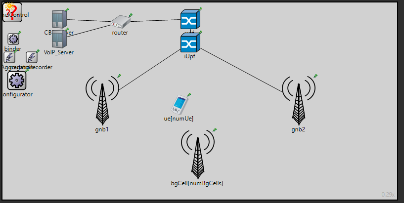
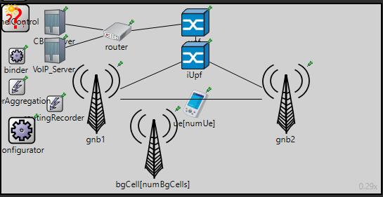

# Overview & Project Information
Designed and simulated a scalable 5G wireless network infrastructure for urban and suburban environments using OMNeT++. The project focused on RF planning, network topology design, QoS optimization, and wireless performance evaluation. 

This project was developed as part of a university group project focused on 5G wireless network design and simulation. My contribution included simulation configuration and performance analysis.

# Objectives
- Design 5G network topologies for different propagation environments
- Simulate urban and suburban deployment scenarios
- Evaluate QoS and network performance
- Analyze throughput, latency and packet loss

# Technologies Used
- OMNeT++
- 5G Networking
- RF Planning
- MIMO
- QoS Analysis
- VoIP / CBR / VoD Traffic Simulation

# Features
- Urban and suburban 5G deployment simulations
- gNodeB placement and cell coverage planning
- Traffic modeling with different load conditions

# Screenshots
The following screenshots demonstrate the implemented 5G network topologies and deployment scenarios within the OMNeT++ simulation environment.

## Macro Cell Topology
Large-area macro-cell topology designed to improve wireless coverage and scalability in suburban environments.



## Micro Cell Topology
Simulation topology demonstrating dense urban 5G deployment using micro cells for higher capacity and QoS optimization.



# Project Structure
```
docs/          -> Project documentation
screenshots/   -> Network topology and result images
configs/       -> Configuration files
```
